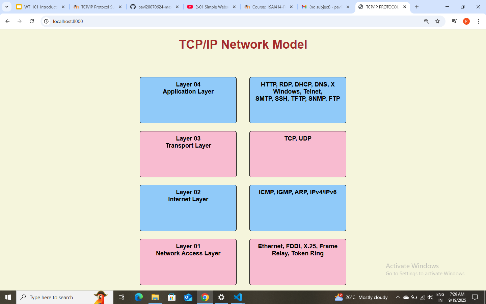

# EX01 Developing a Simple Webserver

# Date: 19/09/2025
# AIM:
To develop a simple webserver to serve html pages and display the configuration details of laptop.

# DESIGN STEPS:
## Step 1:
HTML content creation.

## Step 2:
Design of webserver workflow.

## Step 3:
Implementation using Python code.

## Step 4:
Serving the HTML pages.

## Step 5:
Testing the webserver.

# PROGRAM:
```from http.server import HTTPServer,BaseHTTPRequestHandler
content = ''' <!DOCTYPE html>
<html lang="en">
<head>
    <meta charset="UTF-8">
    <meta name="viewport" content="width=device-width, initial-scale=1.0">
    <title> TCP/IP PROTOCOL SUITE </title> 
    <style>
   .box {
      border: 2px solid black;
      padding: 15px;
      border-radius: 8px;
      font-weight: bold;
      width: 250px;
      text-align: center;
      width: 350px;
      height: 150px;
    }
    h1{
        text-align: center;
        color: brown;
        margin-bottom: 100px;
    }
    .row{
        display: flex;
        gap: 50px;
        align-items: center;
        margin-top: 30px;
        justify-content: center;
    }
     .application { background: #90caf9; }
     .transport   { background: #f8bbd0; }
     .internet    { background: #90caf9; }
     .network     { background: #f8bbd0; }

     body{
         font-family: Arial;
         text-align: center;
         background-color: beige;
         font-size: x-large;
     }
    
    

    

    </style>
</head>
<body>
    <h1>TCP/IP Network Model</h1>

  <!-- Row 1 -->
  <div class="row">
    <div class="box application">Layer 04<br>Application Layer</div>
    <div class="box application">HTTP, RDP, DHCP, DNS, X Windows, Telnet,<br>SMTP, SSH, TFTP, SNMP, FTP</div>
  </div>

  <!-- Row 2 -->
  <div class="row">
    <div class="box transport">Layer 03<br>Transport Layer</div>
    <div class="box transport">TCP, UDP</div>
  </div>

  <!-- Row 3 -->
  <div class="row">
    <div class="box internet">Layer 02<br>Internet Layer</div>
    <div class="box internet">ICMP, IGMP, ARP, IPv4/IPv6</div>
  </div>

  <!-- Row 4 -->
  <div class="row">
    <div class="box network">Layer 01<br>Network Access Layer</div>
    <div class="box network">Ethernet, FDDI, X.25, Frame Relay, Token Ring</div>
  </div>
 </body>
 </html>'''
class MyServer(BaseHTTPRequestHandler):
    def do_GET(self):
        print("Get request received...")
        self.send_response(200)
        self.send_header("content-type","text/html")
        self.end_headers()
        self.wfile.write(content.encode())
print("This is my webserver")
server_address =('',8000)
httpd = HTTPServer(server_address,MyServer)
httpd.serve_forever()
```
# OUTPUT:

 .png)
 
     
# RESULT:
The program for implementing simple webserver is executed successfully.
